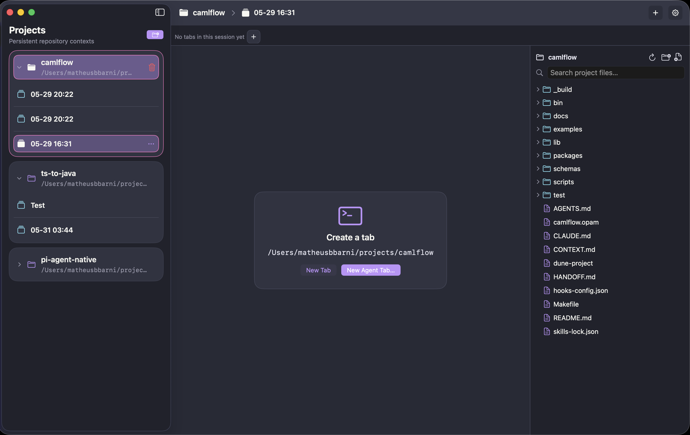

# Atelier

Atelier is an early agentic development environment for macOS, built for developers who want to work with coding agents in a native, transparent workspace.

The idea is simple: keep the app out of the way, keep the state on your machine, and make it obvious what each session, tab, and agent is doing. No browser shell pretending to be a desktop app. No mystery sync layer. Just a Mac app that feels like it belongs on macOS.



## Evaluate Atelier

The primary evaluation path is the repository: inspect the source, current status, and source-build path before relying on packaged releases. The landing page is the short product overview, while this README and the build commands stay available for deeper evaluation.

- [Open the repository](https://github.com/MatheusBBarni/Atelier-ADE) - primary path for source, status, and project reality
- [View the product overview](https://matheusbbarni.github.io/Atelier-ADE/) - screenshot-led orientation to the current product story
- [Read the README](https://github.com/MatheusBBarni/Atelier-ADE#readme) - current docs and capability notes
- [Build and run](https://github.com/MatheusBBarni/Atelier-ADE#build-test-and-run) - source-build quickstart for local evaluation

## What Atelier does today

- keeps projects pinned in a persistent sidebar
- groups work into sessions so related tabs stay together
- opens terminal tabs inside a native macOS window
- supports plain shell sessions plus agent-oriented session starts
- restores workspace state when you relaunch the app

## Why it exists

Most agent tooling still lives in the browser or in editor plugins. That works, but it also means the UI, windowing, shortcuts, and session model are borrowed from somewhere else.

Atelier takes the opposite approach. It starts with the desktop app itself and treats agents as part of the workspace, not as an overlay on top of another tool.

## Build, test, and run

```bash
./scripts/run.sh build
./scripts/run.sh test
./scripts/run.sh run
./scripts/run.sh bundle
```

`./scripts/run.sh` without a mode also builds and launches the app. The helper currently supports these modes:

```bash
./scripts/run.sh run
./scripts/run.sh build
./scripts/run.sh bundle
./scripts/run.sh test
```

The `run` and `bundle` modes create a real macOS app bundle named `Atelier.app` inside `.build/.../debug/`. Release automation packages that app as `Atelier-macOS-<version>.zip`, but local evaluation is still source-build-first.

## Implementation map

- `Sources/` - SwiftUI app shell, workspace models, commands, restore flow, logging, and terminal hosting
- `Tests/` - unit and integration coverage
- `scripts/run.sh` - local build, bundle, and launch helper

## Current status

Atelier is early, usable, and source-build-first. The core loop is there: open a project, start a session, spawn tabs, and come back later without losing the thread.

There is still plenty of room to push the app further, especially around editor surfaces, richer agent workflows, and deeper macOS polish.

## License

The source is public for inspection, but a formal project license has not been finalized yet. Treat reuse rights as pending until a `LICENSE` file is added.
